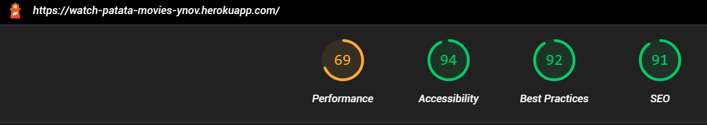
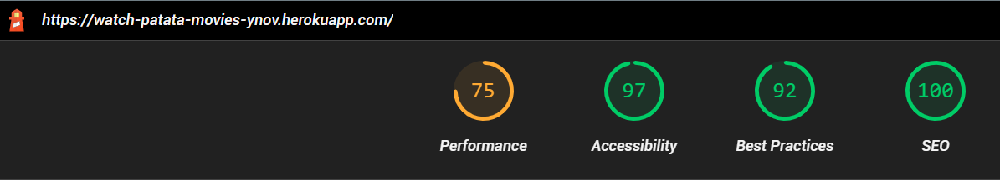

# Le P'tit Ciné Magique

Ce projet a été développer en cours de PWA à Ynov

## Versions :

### Application cinéma 

Familiarisation avec la création des pages HTML + CSS + JavaScript

**Objectif :**
- [X] Création d'une page d'accueil
- [X] Récupération clé api (v3 auth)
- [X] Utilisation API

### Ajout du manifest.json et service worker sw.js 

Création et Ajout des services Worker(sw.js) et Manifest (manifest.json)

**Objectif :**
Ajout de 3 fichiers:
- [X] `app.js` : pour vérifier que le navigator supporte l’API contenant un code permet d’enregistrer le fichier sw.js en tant que Service Worker 
- [X] `manifest.json` : fichier json pour ajouter un raccourci vers notre application sur l’écran d’accueil du téléphone des utilisateurs.
- `sw.js` : fichier javascript permettant de faire
    - [X] le chargement de contenu en mode hors ligne
    - [ ] la synchronisation en arrière-plan
    - [ ] le push de notifications

---

- [X] Utilisation de [Lighthouse](https://developers.google.com/web/tools/lighthouse/), essayer de viser le score 100

Au départ de l'utilisation :

Et maintenant :

Il y a encore des efforts à fournir mais on s'approche :) 

---

Version sur portable avec installation de l'application

## APIs

L'API utilisé pour récupérer les films :  [The Movie Database](https://www.themoviedb.org/?language=fr)

## Déploiement

Actuellement en ligne sur Heroku : [https://watch-patata-movies-ynov.herokuapp.com/](https://watch-patata-movies-ynov.herokuapp.com/)

